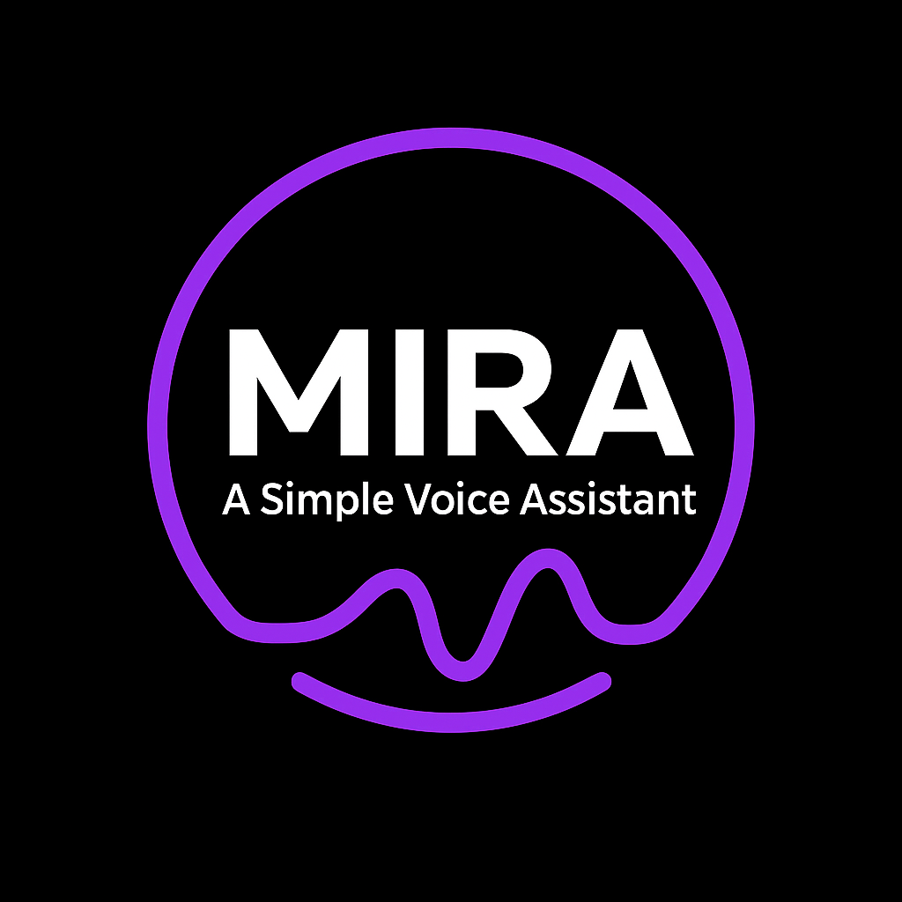

# 🎙️ MIRA – AI Voice Assistant

MIRA is a **Python-based AI voice assistant** that listens to your voice, processes commands, responds intelligently using **Google Gemini AI**, and performs actions like opening websites or playing songs from YouTube.  

It combines:  
- 🎤 Speech Recognition  
- 🗣 Text-to-Speech  
- 🤖 Google Gemini AI (Generative AI)  
- 🌐 Web Automation  
- 🎵 Music Playback  

---

## 🚀 Features
- 🎤 **Voice Recognition** – Listens via your microphone.  
- 🗣 **Text-to-Speech** – Speaks responses aloud.  
- 🤖 **AI Chat** – Powered by **Gemini 1.5 Flash** model.  
- 🌐 **Web Automation** – Opens Google, YouTube, or News instantly.  
- 🎵 **Music Playback** – Plays specific songs via YouTube links.  
- 🔔 **Notification Sound** – Plays a "ding" before listening.  

---

## 📂 Project Structure
```
MIRA/
├── 🎵 ding-36029.mp3       # Notification sound (plays when assistant starts listening)
├── 🧠 main.py              # Core assistant script (voice recognition + Gemini AI + commands)
├── 🎶 music.py             # Song dictionary (title → YouTube link) + Gemini API key
├── 📦 requirements.txt     # Python dependencies
└── 📘 README.md            # Project documentation
```

## 📦 Prerequisites
- **Python 3.9+** installed on your system.  
- Required libraries (listed in `requirements.txt`).  

Install them with:  
```bash
pip install -r requirements.txt
```
---
# Setup and Configuration

## 1. Gemini AI API Key
MIRA uses the Gemini AI model. To get started, you'll need to obtain an API key from **Google AI Studio**.

1. Go to [Google AI Studio](https://aistudio.google.com/).
2. Create a new API key.
3. Create a file named `music.py` in the same directory as the main script.
4. Inside `music.py`, add your API key like this:

```python
apikey = "YOUR_API_KEY_HERE"
```
## 2. Sound File
The program uses a sound file (ding-36029.mp3) to indicate that it has heard a command. You'll need to download this file and place it in a folder named MIRA/main in the same directory as the main script.

You can download the file from this link: https://freesound.org/people/jdwilko/sounds/36029/

## 3. Music Library
The music.py file also holds the URLs for the songs that MIRA can play. You'll need to define your own dictionary of songs and their YouTube links.
```python
music = {
    "na ja": "https://youtu.be/Q-GOFPM01d0?si=BtiRqQX431nKKRl3",
    "sahiba": "https://youtu.be/n2dVFdqMYGA?si=m6yfuBzTiHbrx69W",
    # Add your own songs here
}
```
## How to Run
- Make sure you have completed the setup steps above.

 - Open your terminal or command prompt.

- Navigate to the directory where you saved the script.

- Run the script using the following command:
```python
python your_script_name.py
```
---
# Usage
- Once you run the script, MIRA will initialize and say "Initializing MIRA...".

- Listen for Commands: MIRA will automatically start listening for your voice.

- Give a Command: Say one of the predefined commands, like "Open Google" or "Play Old Town Road."

- Ask a Question: Ask MIRA any question, and it will use Gemini AI to respond.

- Exit: To end the program, say "Bye-bye."
# Troubleshooting
- "Recognition Error": This usually means you have a problem with your microphone or internet connection.

- "No song found": Make sure you have the exact song title listed in the music dictionary.

- "No speech detected": Speak more clearly or try to adjust your microphone's volume.
---
